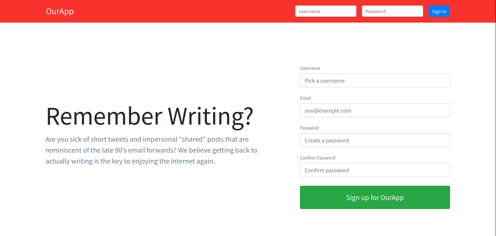
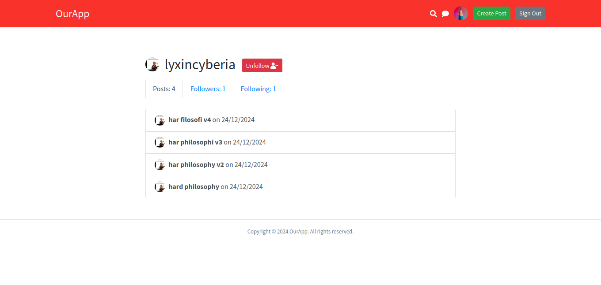
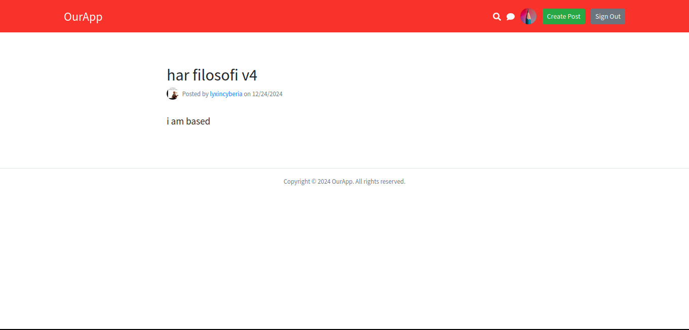

# Blog

A simple blog made in Laravel. This blog features:

- User Authentication
- Blog Posts
- Profiles and profile editing
- Follow system
- Live search functionality
- Chat using Pusher

## Screenshots

